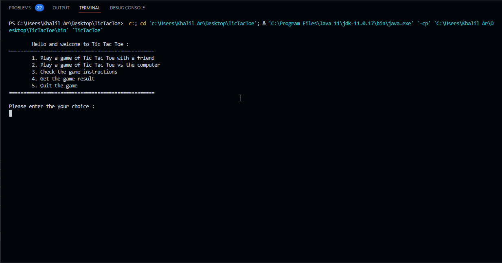

# TicTacToe
This repo is an implementation in Java of the game TicTactoe 

What you can do :

- You can check the games instructions to understand how to play
- You can play with a friend
- You can also choose to play versus the computer 
- You can also get the result of a given tictactoe game
- And Finally you can quit the game

The following GIF shows the execution of the program:

